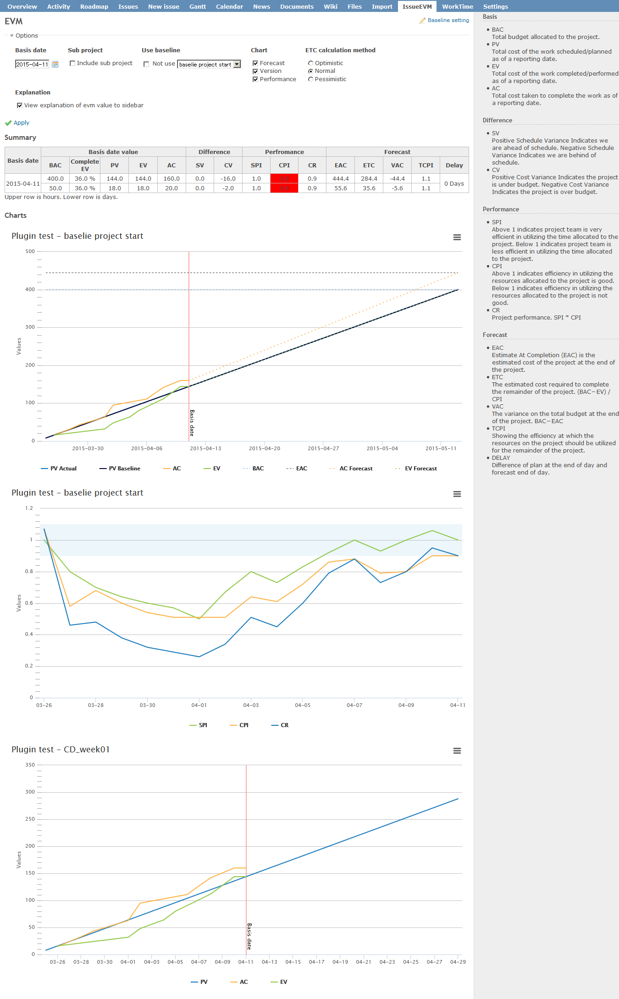
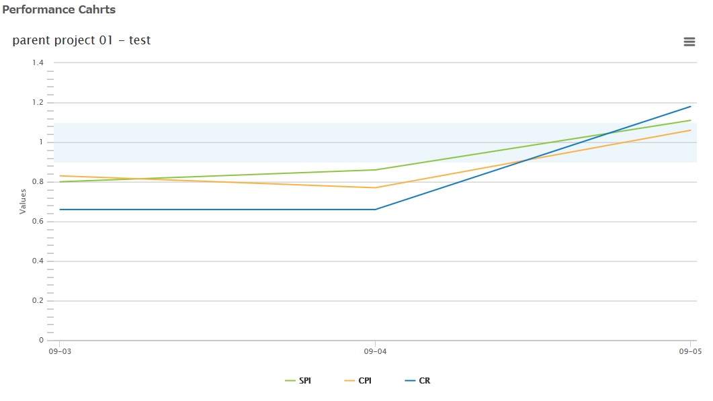
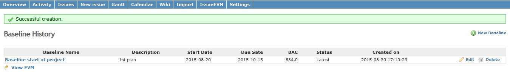

#redmine_issue_evm
Earned value management using the ticket of redmine.
Calculating the EVM values using start-date, due-date, and estimated hours of the issue.

* PV : Use the estimated-hours, start date, due date.
* EV : Use the estimated-hours. Added to the closed date of issue.
* AC : Use time entries.

# Example
Create ticket#1(start date:2015/08/01 due date:2015/08/03 estimate-hours:30hrs).
* PV -> 8/1:10hrs 8/2:10hrs 8/3:10hrs　(10s per day)
* EV -> 0
* AC -> 0

| EVM | 8/1 | 8/2 | 8/3 |
| --- | --- | --- | --- |
| PV  | 10  | 20  | 30  |
| EV  | 0   | 0   | 0   |
| AC  | 0   | 0   | 0   |

Acumulate PV.

Entered work time of Ticket#1. 8/1->10hrs, 8/2->6hrs, 8/3->7hrs.
* PV -> 8/1:10hrs 8/2:10hrs 8/3:10hrs
* EV -> 0
* AC -> 8/1:10hrs 8/2:6hrs 8/3:7hrs

| EVM | 8/1 | 8/2 | 8/3 |
| --- | --- | --- | --- |
| PV  | 10  | 20  | 30  |
| EV  | 0   | 0   | 0   |
| AC  | 10  | 16  | 23  |

Acumulate AC

Ticket#1 is closed on 8/3.
* PV -> 8/1:10時間 8/2:10時間 8/3:10時間
* EV -> 8/3:30時間
* AC -> 8/1:10時間 8/2:6時間 8/3:7時間

| EVM | 8/1 | 8/2 | 8/3 |
| --- | --- | --- | --- |
| PV  | 10  | 20  | 30  |
| EV  | 0   | 0   | 30  |
| AC  | 10  | 16  | 23  |

# Version
3.1.2

# Environment
Bitnami redmine 3.1.0

# Installation
Use zip file

1. Download zip-file
2. cd {redmine_root}/plugins/; mkdir redmine_issue_evm
3. Extract files to {redmine_root}/plugins/redmine_issue_evm/
4. rake redmine:plugins:migrate NAME=redmine_issue_evm RAILS_ENV=production

Use git clone

    git clone git://github.com/momibun926/redmine_issue_evm {redmine_root}/plugins/redmine_issue_evm

# Screen shots

Overview

Performance chart

Baseline setting

History

New baseline

Contributing
=================

1. Fork it
2. Create your feature branch (git checkout -b my-new-feature)
3. Commit your changes (git commit -am 'Add some feature')
4. Push to the branch (git push origin my-new-feature)
5. Create new Pull Request
