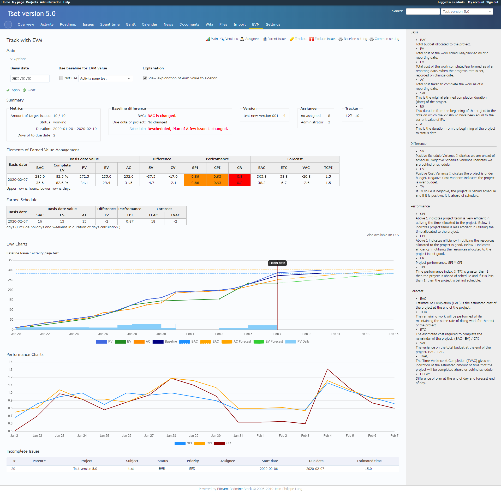
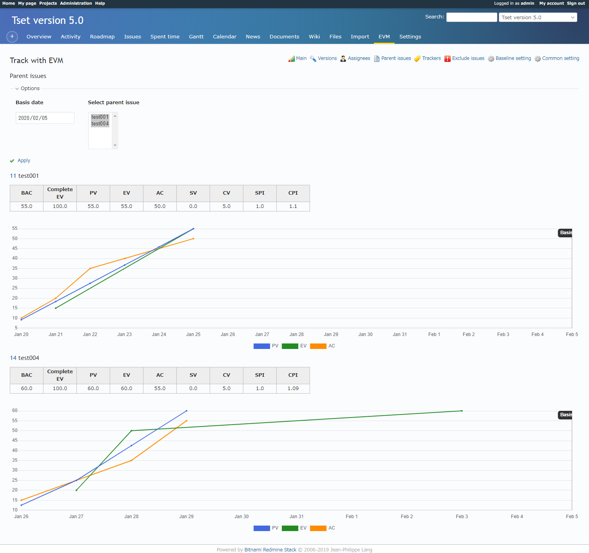
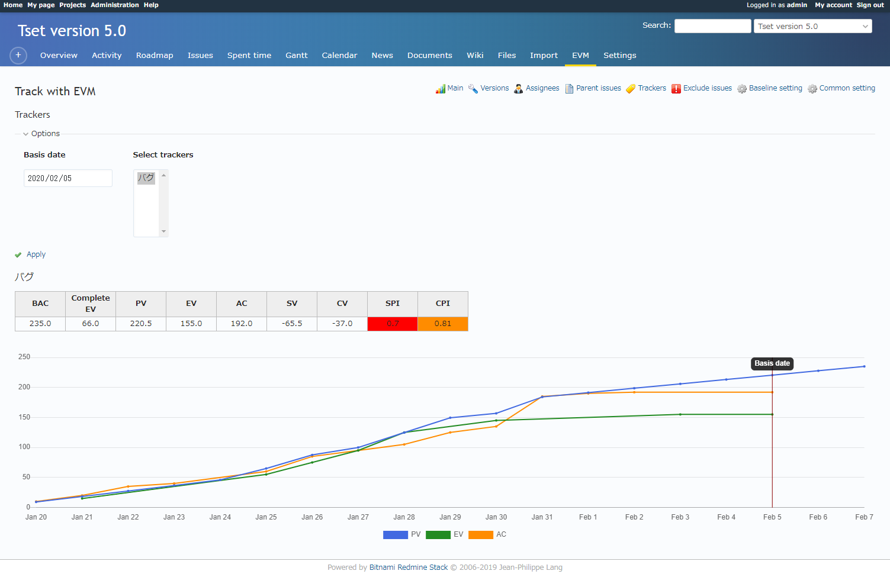
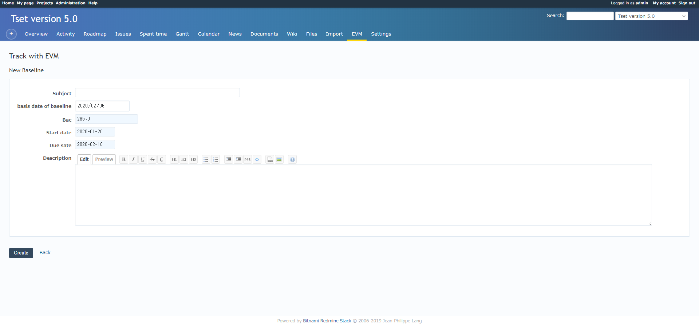
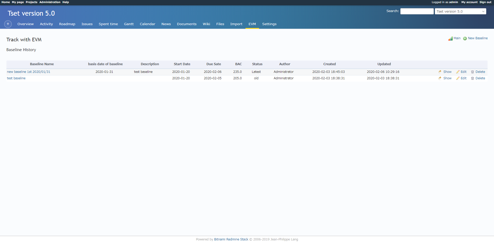
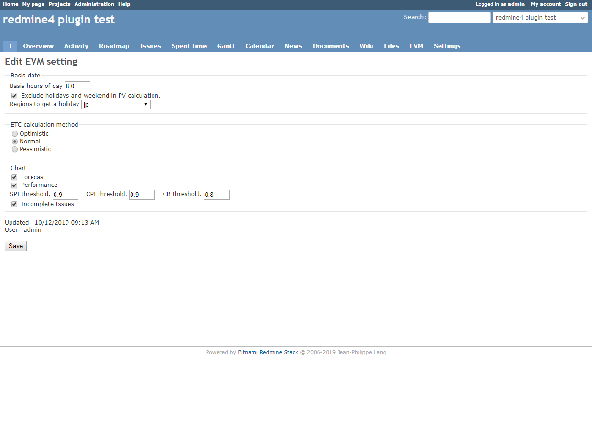

# Earned Value Management (EVM) Calculation Plugin

[](http://www.redmine.org/plugins/redmine_issue_evm)

This plugin provides the function of calculating evm of projects . EVM can help you to track your project progress and its status and to forecast the future performance of the project.

## Current Version
5.3.4

## Compatibility
Redmine 4.0.0 and above

> *For those who like highchart graph display*
>
> Charts are displayed using Chart.js from Version 5.0.
> Use the following version for Highcharts graph display.
> https://github.com/momibun926/redmine_issue_evm/releases/tag/4.6

> *Notification*
>
> The redmine3.4.x compatible version in branch "redmine3-4-3".
> https://github.com/momibun926/redmine_issue_evm/tree/redmine3-4-3

# Main features
* Calculate EVM with chart
  * All projects with ES
  * Each version
  * Each asssignee (Shown estimated hours each days on chart)
  * Each parent issues
  * Some Tarckers
* Project metrics
  * Duration
  * Satus
  * Days until due date
  * Amount of calculation issues
  * Variance at baseline
  * Amount of issue. (version, assignee, tracker)
  * Chart of EVM(PV,EV,AC), Forecast is invalid when project is finished.
* Common setting
  * Basic time of day
  * Calculation method of ETC
  * Forcast chart, Performance chart, Threthold value, incomplete issues
* Create baselines, and view history

# How to calculate EVM
The below are used for EVM.

* start date
* due date　(If empty, effective of version)
* estimated time (If you set it as 0, you will not get PV, CV)
* spent time

If you input these into your project, it can help you to calculate both a single issue’s EVM and whole project’s one.

* PV: Dividing estimated time by the days (from start date to due date(or effective date of version )) to get daily workload
* EV: After issues are closed, you can get EV.　When the progress rate is set, it is calculated by estimated time. (progress rate on the day when the progress is set.)
* AC: Total work hours of PV issues.

**Example**

(1) Create an issue with:

* start date:  2015/08/01
* due date:  2015/08/03
* estimated time: 24 hours

At that time, only PV is calculated. As you have not closed the issue yet, EV equals 0.
PV: Dividing estimated time: 24hours by 3 days (from start date to due date)

| EVM | 8/1 | 8/2 | 8/3 |
| --- | --- | --- | --- |
| PV  | 8   | 16  | 24  |
| EV  | 0   | 0   | 0   |
| AC  | 0   | 0   | 0   |

(2) Input your spent time.

8/1: 10.0hours  8/2: 6.0hours 8/3: 8.0hours

| EVM | 8/1 | 8/2 | 8/3 |
| --- | --- | --- | --- |
| PV  | 8   | 16  | 24  |
| EV  | 0   | 0   | 0   |
| AC  | 10  | 16  | 24  |

(3) After finishing the issue, close it on 8/3. EV will be calculated on 8/3.

| EVM | 8/1 | 8/2 | 8/3 |
| --- | --- | --- | --- |
| PV  | 8   | 16  | 24  |
| EV  | 0   | 0   | 24  |
| AC  | 10  | 16  | 24  |

Based on these data, EVM and chart are created.

## Baseline
If you set baseline, you can know easily how project divergence is and whether new task (issues) can be added by chart. In other words, you can see whether your estimated daily workload is over or not by chart.
PV is based on your baseline. In addition, you can set calculation without baseline by options.

## View options
* Change the calculating basic date
* Using baseline
* Explanation of EVM

## About workig days
1. Excluding weekends and holidays
2. If it is only weekends or holidays, make it a working day
3. Use holidays gem -> Regional settings are set in the common setting page(common setting link in contextial)

Example)

In Japan, May 3, May 4, May 5 are holidays

* Including weekends and holidays

|Start date          |Due date            |Estimated time |Working day|PV per day|
|--------------------|--------------------|---------------|-----------|----------|
|May 1, 2017 (Monday)|May 8, 2017 (Monday)|12 hours       |3 days     |4 hours   |

* Including only a few weekends and holidays

|Start date          |Due date            |Estimated time |Working day|PV per day|
|--------------------|--------------------|---------------|-----------|----------|
|May 1, 2017 (Monday)|May 7, 2017 (Sunday)|10 hours       |2 days     |5 hours   |

* Only weekends and holidays

|Start date          |Due date            |Estimated time |Working day|PV per day|
|--------------------|--------------------|---------------|-----------|----------|
|May 3, 2017 (Wed)   |May 7, 2017 (Sunday)|20 hours       |5 days     |4 hours   |

# Chart
Charts are displayed using Chart.js. This java scripts include Redmine.

**Main chart**

Show PV,EV,AC with baseline. Display unclosed issues according to the baseline.

**Performance chart**

Show SPI,CPI,CR of the days involved with PV,EV,AC

# Installation
(1) Getting plugin source

**case of zip file.**

* Download zip-file
* Create a folder named redmine_issue_evm under [redmine_root]/plugins/
* Extract zip file in redmine_issue_evm

**Case of git clone.**

```
git clone git://github.com/momibun926/redmine_issue_evm [redmine_root]/plugins/redmine_issue_evm
```

(2) bundle install

```
bundle install
```

(3) Migration. At the command line type

```
rake redmine:plugins:migrate NAME=redmine_issue_evm RAILS_ENV=production
```

(4) Restart your Redmine web servers (e.g. mongrel, thin, mod_rails).

(5) Login and configure the plugin (see Permissions section, Administration->plugin)

# UnInstall
```
rake redmine:plugins:migrate NAME=redmine_issue_evm VERSION=0
```

# Screen shots
**Overview**


**Assignees**


**Prent issues**


**Trackers**


**Create baseline**


**Baseline History**


**Plugin Setting**


# Contributing
1. Fork it
2. Create your feature branch (git checkout -b my-new-feature)
3. Commit your changes (git commit -am 'Add some feature')
4. Push to the branch (git push origin my-new-feature)
5. Create new Pull Request

# My Environment
*  Redmine version                4.1.1.stable
*  Ruby version                   2.5.8-p224 (2020-03-31) [x86-64-linux]
*  Rails version                  5.2.4.2
*  Environment                    production
*  Database adapter               Mysql2
*  Mailer queue                   ActiveJob::QueueAdapters::AsyncAdapter
*  Mailer delivery                smtp

#### Translators
I appreciate your cooperation, Wen Wen, Shen.
