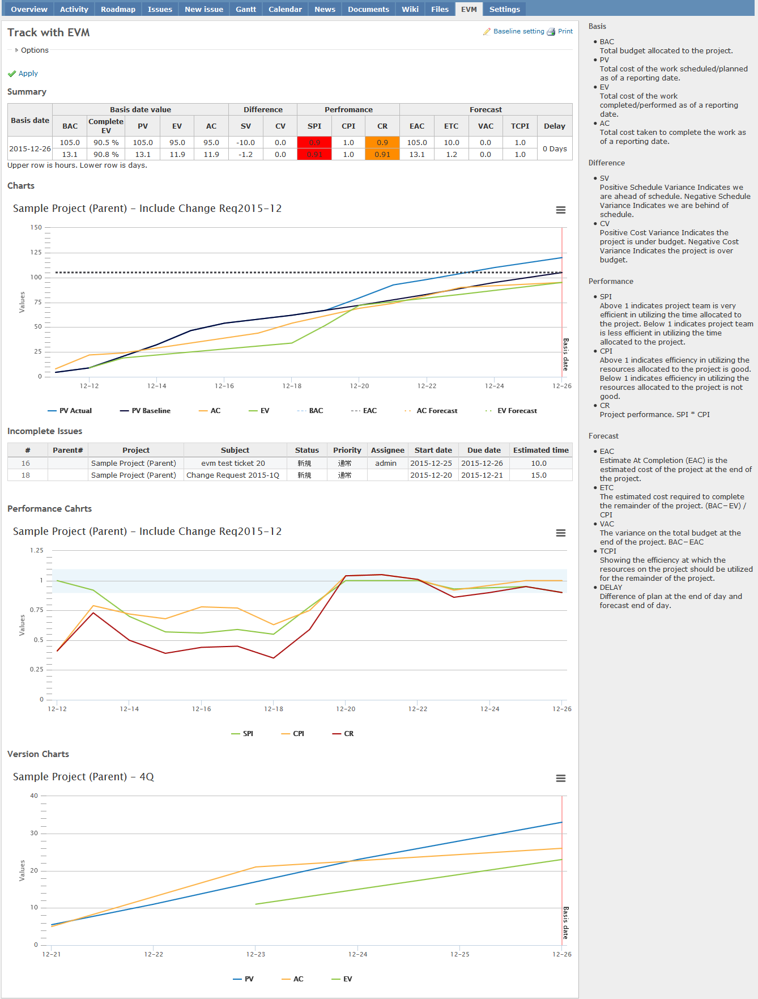
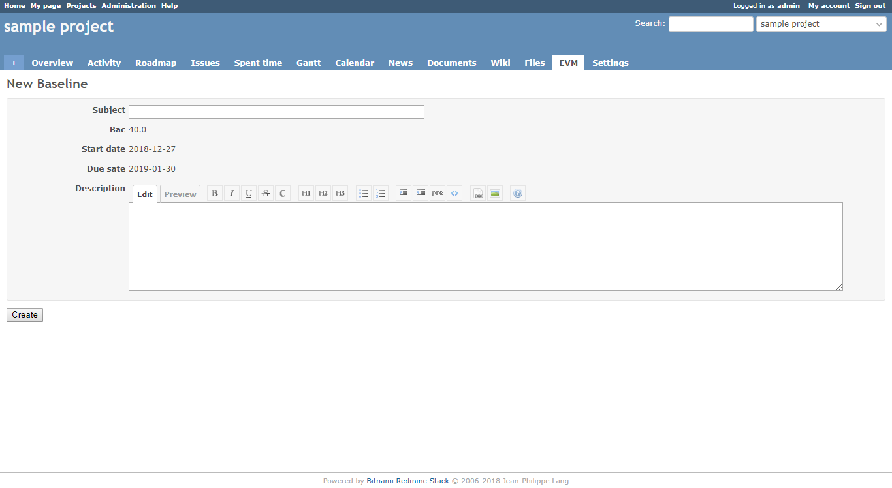
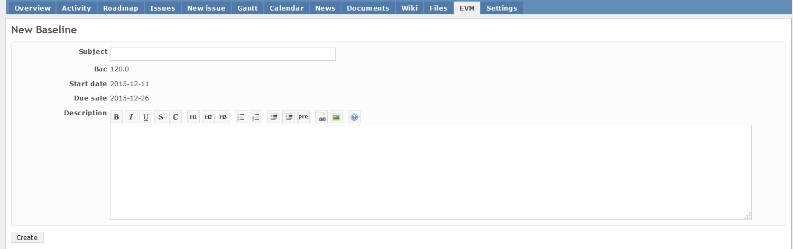
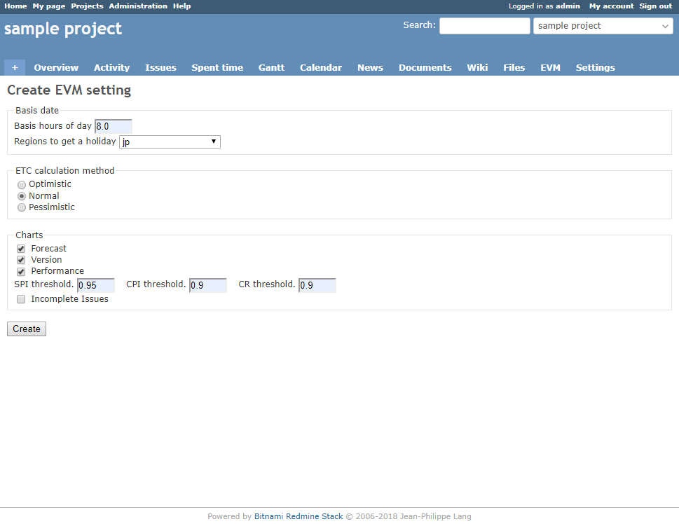

# Earned Value Management (EVM) Calculation Plugin

[](http://www.redmine.org/plugins/redmine_issue_evm)

This plugin provides the function of calculating evm of projects . EVM can help you to track your project progress and its status and to forecast the future performance of the project.

## Current Version
4.0

## Compatibility
Redmine 3.4.0 and above

## Main features
* Calculate EVM
* Chart with EVM (PV,EV,AC)
* Set the baseline　and show history

## Baseline
If you set baseline, you can know easily how project divergence is and whether new task (issues) can be added by chart. In other words, you can see whether your estimated daily workload is over or not by chart.
PV is based on your baseline. In addition, you can set calculation without baseline by options.

## Additional options
* Explanation of EVM
* Chart with Project Performance (SPI,CPI,CR)
* Chart with each version
* Select past baseline
* Change the calculating basic date
* Change the level of the forecast
* Show unfinished issues

## workig days
1. Excluding weekends and holidays
2. If it is only weekends or holidays, make it a working day
3. Use holidays gem -> Regional settings are set in the plugin setting page(Administration->plugins)

Example)

In Japan, May 3, May 4, May 5 are holidays

* Including weekends and holidays

|Start date          |Due date            |Estimated time |Working day|PV per day|
|--------------------|--------------------|---------------|-----------|----------|
|May 1, 2017 (Monday)|May 8, 2017 (Monday)|12 hours       |3 days     |4 hours   |

* Including only a few weekends and holidays

|Start date          |Due date            |Estimated time |Working day|PV per day|
|--------------------|--------------------|---------------|-----------|----------|
|May 1, 2017 (Monday)|May 7, 2017 (Sunday)|10 hours       |2 days     |5 hours   |

* Only weekends and holidays

|Start date          |Due date            |Estimated time |Working day|PV per day|
|--------------------|--------------------|---------------|-----------|----------|
|May 3, 2017 (Wed)   |May 7, 2017 (Sunday)|20 hours       |5 days     |4 hours   |

## Page print
If you are using the latest browser, please use the printing function of the browser.
Printing is possible with Summary,Main-chart,Incomplete Issues.

# How to calculate EVM
The below are used for EVM.

* start date
* due date　(If empty, effective of version)
* estimated time (If you set it as 0, you will not get PV, CV)
* spent time

If you input these into your project, it can help you to calculate both a single issue’s EVM and whole project’s one.
PV: Dividing estimated time by the days (from start date to due date(or effective date of version )) to get daily workload
EV: After issues are closed, you can get EV.

**Example**

(1) Create an issue with:

* start date:  2015/08/01
* due date:  2015/08/03
* estimated time: 24 hours

At that time, only PV is calculated. As you have not closed the issue yet, EV equals 0.
PV: Dividing estimated time: 24hours by 3 days (from start date to due date)

| EVM | 8/1 | 8/2 | 8/3 |
| --- | --- | --- | --- |
| PV  | 8   | 16  | 24  |
| EV  | 0   | 0   | 0   |
| AC  | 0   | 0   | 0   |

(2) Input your spent time.

8/1: 10.0hours  8/2: 6.0hours 8/3: 8.0hours

| EVM | 8/1 | 8/2 | 8/3 |
| --- | --- | --- | --- |
| PV  | 8   | 16  | 24  |
| EV  | 0   | 0   | 0   |
| AC  | 10  | 16  | 24  |

(3) After finishing the issue, close it on 8/3. EV will be calculated on 8/3.

| EVM | 8/1 | 8/2 | 8/3 |
| --- | --- | --- | --- |
| PV  | 8   | 16  | 24  |
| EV  | 0   | 0   | 24  |
| AC  | 10  | 16  | 24  |

Based on these data, EVM and chart are created.

# Chart
3 types of charts can be displayed.
Charts are displayed using HigthChart. See below for license.
It is a license that can not be used for commercial purposes.
https://creativecommons.org/licenses/by-nc/3.0/

**Main chart**

Show PV,EV,AC with baseline.Display unclosed issues according to the baseline.

**Performance chart**

Show SPI,CPI,CR of the days involved with PV,EV,AC

**Version chart**

Show PV,EV,AC of every version in the issue

# Installation
(1) Getting plugin source

**case of zip file.**

* Download zip-file
* Create a folder named redmine_issue_evm under [redmine_root]/plugins/
* Extract zip file in redmine_issue_evm

**Case of git clone.**

```
git clone git://github.com/momibun926/redmine_issue_evm [redmine_root]/plugins/redmine_issue_evm
```

(2) bundle install

```
bundle install
```

(3) Migration. At the command line type

```
rake redmine:plugins:migrate NAME=redmine_issue_evm RAILS_ENV=production
```

(4) Restart your Redmine web servers (e.g. mongrel, thin, mod_rails).

(5) Login and configure the plugin (see Permissions section, Administration->plugin)

# UnInstall
```
rake redmine:plugins:migrate NAME=redmine_issue_evm VERSION=0
```

# Screen shots
**Overview**


**Baseline History**


**Create baseline**


**Plugin Setting**


# Contributing
1. Fork it
2. Create your feature branch (git checkout -b my-new-feature)
3. Commit your changes (git commit -am 'Add some feature')
4. Push to the branch (git push origin my-new-feature)
5. Create new Pull Request

# My Environment
* Redmine version                3.4.2.stable
* Ruby version                   2.3.3-p222 (2016-11-21) [i386-mingw32]
* Rails version                  4.2.8
* Environment                    production
* Database adapter               Mysql2

#### Translators
I appreciate your cooperation, Wen Wen, Shen.
