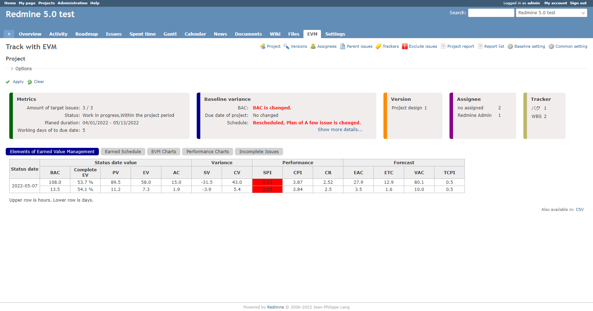
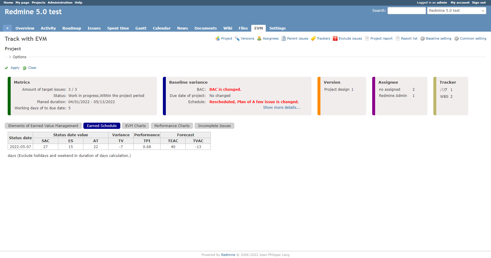
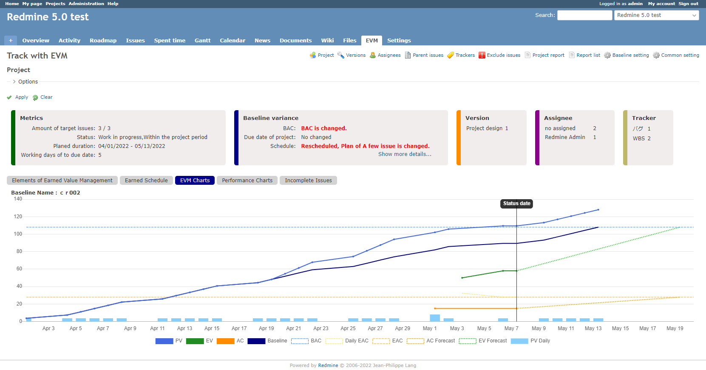
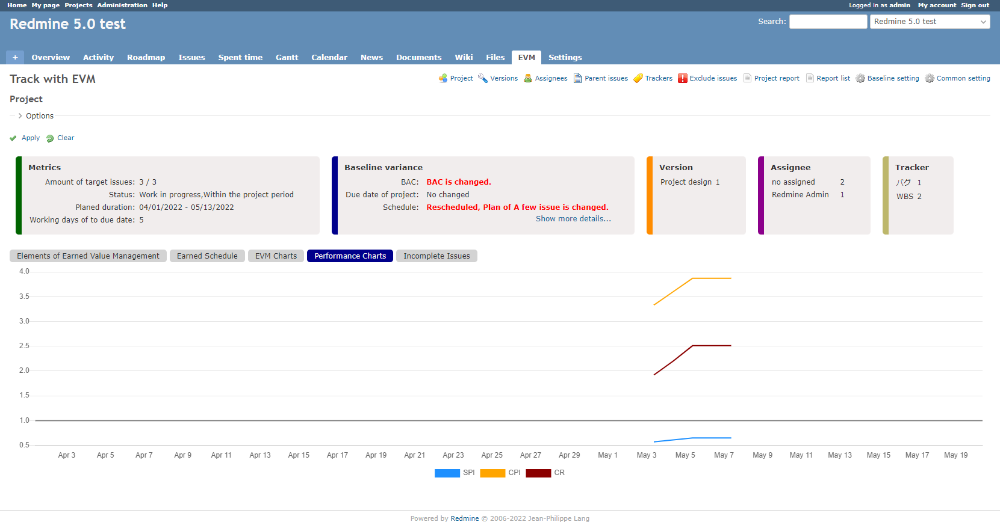
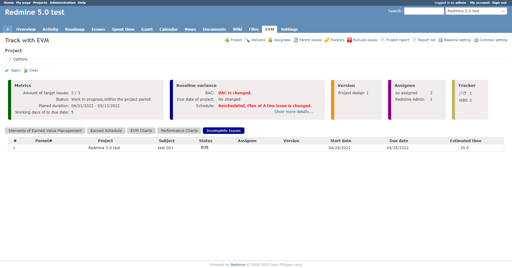

# Earned Value Management (EVM) Calculation Plugin

[](http://www.redmine.org/plugins/redmine_issue_evm)

チケットの開始日、期日、予定工数、作業時間を利用してEVM値の計算とチャートを表示する機能を提供しています。期日が入力されず、バージョンの期日がある場合は、期日としてバージョンの期日を利用します。

# バージョン
6.0.2

# 動作環境
Redmine 5.0.0 以上

> *redmine5以外をお使いの方へ*
>
> Redmine3.4.xの対応版は、ブランチ"Redmine3-4-3"を取得してください。
> https://github.com/momibun926/redmine_issue_evm/tree/redmine3-4-3
>
> Redmine4.x.xの対応版は、ブランチ"Redmine4.0"を取得してください。
> https://github.com/momibun926/redmine_issue_evm/tree/redmine4.0

# 主な機能
## 基本情報の表示
* プロジェクトの期間
* ステータス
* プロジェクト期日までの日数
* 計算対象となっているチケットの件数
* ベースラインとの差異とそのチケットのリスト
* バージョン、担当者別、トラッカー別のチケット件数
* EVM(PV,EV,AC)のチャート表示。予測のチャートはプロジェクトが完了すると表示されません。

## EVM値の計算
* プロジェクト全体（子孫プロジェクトを含む）ESも計算します
* バージョン別
* 担当者別（日毎の予定時間を含む）
* 親チケット別
* トラッカー別
* 日毎の進捗率を基にしたEVの計算
* 日毎のEAC
* 計算対象にならなったチケットの一覧
* 概要ページにEVM値のサマリーを表示

## ベースラインの作成
ある時点のPVを記録しておくことが出来ます。
作成したベースラインは一覧から詳細を参照する事が可能です。

## 表示オプション
EVM値の計算、チャートの表示は以下のオプションが選択可能です。
* EVM値の説明を表示
* EVM値を計算する基準日の変更
* ベースラインもしくは、すべてのチケットをもとにしたEVMの計算

## EVMをもとにしたプロジェクトの報告
* EVM値ともにプロジェクト概況を記録できます
* 過去の概況の一覧、照会、編集

## プラグイン全体の設定管理
* 基準日、基準時間
* ETCの計算方法
* 予測チャート表示、パフォーマンスチャートの表示、閾値、未完了チケットの表示

# EVM値の計算について
プロジェクト(子孫プロジェクト含む)内の、以下のすべての項目に入力があるチケットを対象にして、EVM値を計算しています。

* 開始日
* 期日
* 予定工数(0でも構いませんがPV,EVが計算できないため意味がありません)

Redmine3.1から親チケットの予定工数が入力可能になったので、チケットの親子関係に関係なくチケット毎にPV,EVを算出しています。

* PV : 開始日、期日、予定工数を利用して、PVを計算します。日毎の工数を計算しています。
* EV : チケットをCLOSEした日に、予定工数をEVとして計算しています。進捗率が設定されている場合は、進捗率をセットした日に、予定工数に進捗率をかけて計算しています。
* AC : PVの計算に使われているチケットの作業時間を使って、ACを計算しています。

## EVM値の計算例
開始日:2015/08/01,期日:2015/08/03,予定工数:24.0時間のチケットを作成。この時点では、PVのみが有効。PVは日毎のPVから累積値を計算しています。チケットが完了していないので、EVは計算されません。

* PV -> 8/1:8.0時間 8/2:8.0時間 8/3:8.0時間　(24時間を3日で割って日毎のPVを計算)
* EV -> 0
* AC -> 0

| EVM | 8/1 | 8/2 | 8/3 |
| --- | --- | --- | --- |
| PV  | 8   | 16  | 24  |
| EV  | 0   | 0   | 0   |
| AC  | 0   | 0   | 0   |

チケットの作業時間を8/1,8/2,8/3に10.0時間、6.0時間、7.0時間入力する。日毎のPVに対して、ACの累積値が計算されます。
* PV -> 8/1:8.0時間 8/2:8.0時間 8/3:8.0時間
* EV -> 0
* AC -> 8/1:10.0時間 8/2:6.0時間 8/3:8.0時間

| EVM | 8/1 | 8/2 | 8/3 |
| --- | --- | --- | --- |
| PV  | 8   | 16  | 24  |
| EV  | 0   | 0   | 0   |
| AC  | 10  | 16  | 24  |

チケットを8/3にCLOSEする。チケットのクローズした日がEVの計上日になります。
* PV -> 8/1:8.0時間 8/2:8.0時間 8/3:8.0時間
* EV -> 8/3:24.0時間
* AC -> 8/1:10.0時間 8/2:6.0時間 8/3:8.0時間

| EVM | 8/1 | 8/2 | 8/3 |
| --- | --- | --- | --- |
| PV  | 8   | 16  | 24  |
| EV  | 0   | 0   | 24  |
| AC  | 10  | 16  | 24  |

上記のPV,EV,ACをもとに、チャート、EVM値を計算しています。

## 稼働日について
1. 土日、休日は除外してPVを計算出来ます。（共通設定ページで設定してください）
2. もしチケットの期間が、週末、休日のみの場合は、すべて稼働日とします
3. 休日はholidays gemを使っています。対象となる地域は共通設定ページで設定してください。

例)

日本では2017年は　5/3,5/4,5/5　は祝日です。チケットの期間によって以下のように計算します。

* チケットの期日に週末、祝日が含まれている場合

|開始日              |期日         　　　　   |見積もり時間 　　　|稼働日数　|1日あたりの見積もり時間|
|--------------------|--------------------|---------------|---------|------------------|
|May 1, 2017 (Monday)|May 8, 2017 (Monday)|12 hours       |3 days   |4 hours           |

* チケットの期日に週末、祝日が含まれている場合(期日が週末)

|開始日              |期日         　　　　   |見積もり時間 　　　|稼働日数　|1日あたりの見積もり時間|
|--------------------|--------------------|---------------|---------|------------------|
|May 1, 2017 (Monday)|May 7, 2017 (Sunday)|10 hours       |2 days   |5 hours           |

* チケットの期日が祝日、休日のみの場合

|開始日              |期日         　　　　   |見積もり時間 　　　|稼働日数　|1日あたりの見積もり時間|
|--------------------|--------------------|---------------|-----------|----------------|
|May 3, 2017 (Wed)   |May 7, 2017 (Sunday)|20 hours       |5 days     |4 hours         |

## ベースラインについての補足
ある時点のPVを記録する機能となっています。ベースラインを設定しておくことで、ベースライン作成以降、タスクの増加(チケットが増加)、スケジュール変更がチャート上に表示され、ベースラインからどれくらい乖離しているかが確認しやすくなります。
なお、ベースラインが設定されている場合は、ベースラインをもとにEVM値が計算されますので、注意してください。ただし、表示オプションの設定で、ベースラインを利用しないでEVM値を計算することもできます。この場合はベースライン設定後に変更・登録されたチケットも含めてEVM値が計算されます。（プロジェクトの実情に合わせて計算されることになります）
過去に設定したベースラインを参照することもできます。

# チャートの表示
計算されたEVM値を元に、以下のチャートを表示します。
チャートの表示には、Chart.jsを利用しています。Redmine4.2で利用されていたChart.bundle.min.jsをこのプラグインインのために同梱しています。

**メインチャート**
計算対象のチケットからPV,EV,ACの累積値を時系列で表示します。ベースラインが設定されている場合は、ベースラインも表示します。

**パフォーマンスチャート**
PV,EV,ACが計算されている日だけ、SPI,CPI,CRを計算して表示します。プロジェクトメンバーこまめにちてっとのクローズ、作業時間のエントリーをしている場合は、プロジェクト全体のパフォーマンスの計測と予測の精度が上がります。

**バージョン別チャート**
あなたのプロジェクトがバージョンを活用しているのならば、とても役に立つチャートです。プロジェクト内の任意のバージョンを選択して、チャートを表示することが可能です。

**担当者別チャート**
プロジェクトのメンバー多い場合にとても役に立ちます。メンバー各々のチャートを俯瞰することが出来るため、プロジェクト全体を見ているだけではわからない、メンバーの一人一人のパフォーマンスを見る事が出来ます。

**親チケット別チャート**
チケットを階層構造にしてタスク管理をしている人向けです。

**トラッカー別チャート**
トラッカーを細分化して管理している人向けです。EVMの計算対象にしたくないトラッカーがる場合は、必要なトラッカーだけ選択してチャートを表示する事事ができます。

# インストール
(1) ソースの取得

**ZIPファイルの場合**

* ZIPファイルをダウンロードします
* [redmine_root]/plugins/へ移動して、redmine_issue_evmフォルダを作成してください
* 作成したフォルダにZIPファイルを解凍します

**クローンでソースを取得**
```
git clone https://github.com/momibun926/redmine_issue_evm [redmine_root]/plugins/redmine_issue_evm

```
(2) bundle install
```
bundle install
```

(3) マイグレーション。次のコマンドをタイプしてください。
```
rake redmine:plugins:migrate NAME=redmine_issue_evm RAILS_ENV=production
```

(4) Redmineを再起動します (e.g. mongrel, thin, mod_rails).

(5) ログインして、パーミッションとプラグイン設定をします。

# アンインストール
```
rake redmine:plugins:migrate NAME=redmine_issue_evm VERSION=0
```

# 画面サンプル
**メインページ-EVM**

**メインページ-ES**

**メインページ-EVMチャート**

**メインページ-Performaneceチャート**

**メインページ-未完了チケット**


**担当別**


**親チケット別**


**トラッカー別**


**ベースラインの作成**


**ベースラインの履歴**


**プラグイン全体の設定**


# 開発環境
Windows10のノートPCで開発しています。VirtualBoxにUbuntu20.04 ServerをたててRuby,Rails,PostgreSQL,Apacheをインストールして環境を作っています。テストコードかけないので、メジャーバージョンアップの時は地道にチケットを登録しながらEVM値の計算、チャートの表示などを目視でチェックしています。

* OS(VirtualBox)                 Ubuntu 20.04 Server
* HTTP Server                    Apache
* Redmine version                5.0.0.stable.21553
* Ruby version                   3.1.2-p20 (2022-04-12) [x86_64-linux]
* Rails version                  6.1.5.1
* Environment                    production
* Database adapter               PostgreSQL
* Mailer queue                   ActiveJob::QueueAdapters::AsyncAdapter
* Mailer delivery                smtp